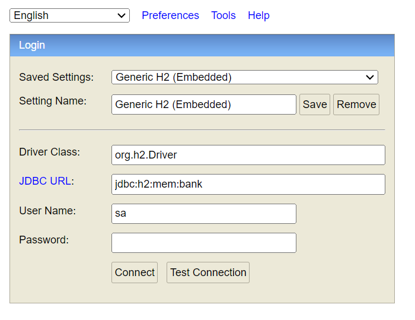

# Spring/Angular Containerized Application

This repository contains a Spring backend and an Angular frontend, both containerized using Docker. Docker Compose is used to orchestrate the application.

## Prerequisites

Before you begin, ensure you have the following installed on your machine:

- **Docker (including Docker Compose):** [https://docs.docker.com/get-started/](https://docs.docker.com/get-started/)
- **Node.js (for Angular development - Optional):** [https://nodejs.org/en](https://nodejs.org/en)
- **Java JDK (for Spring development - Optional):** [https://www.oracle.com/java/technologies/javase/jdk17-archive-downloads.html](https://www.oracle.com/java/technologies/javase/jdk17-archive-downloads.html)

## Project Structure

```bash
project-root/
├── docker-compose.yml
├── digital-banking-angular-front/
│   ├── Dockerfile
│   └── ...
└── digital-banking-spring-backend/
    ├── Dockerfile
    └── ...
```

## Running the Application
- **Build the Docker containers:** [docker-compose build]
- **Start the Docker containers:** [docker-compose up]
- **Stop the containers:** [docker-compose down]

## Access the application
- **Frontend:** http://localhost
- **Backend:** http://localhost:8085
- **H2 Database:** http://localhost:8085/h2-console

     

    
    
    
                                                                HH   HH     AAAAA     VV    VV    EEEEEEE
                                                                HH   HH    AA   AA    VV    VV    EE
                                                                HHHHHHH   AAAAAAAA    VV    VV    EEEEE
                                                                HH   HH   AA    AA    VV    VV    EE
                                                                HH   HH   AA    AA     VVVVVV     EEEEEEE

                                                                FFFFFFF    UUU   UUU    NNN   NNN
                                                                FF         UUU   UUU    NNNN  NNN
                                                                FFFFFF     UUU   UUU    NNN N NNN
                                                                FF         UUU   UUU    NNN  NNNN
                                                                FF          UUUUUUU     NNN   NNN